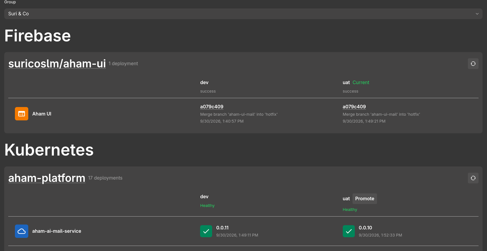

In the [first NeuSix IDP update](/blog/developing-an-idp-at-neusix), I covered the foundation of our Backstage-based developer portal: Keycloak authentication, deployment visibility, Kargo promotions, Kubernetes integration, and observability.

The second product update adds another promotion path backed by GitLab pipelines. Instead of making the portal responsible for deployment execution, the IDP hands the promotion request to the CI/CD workflow that already owns the service's release process.

## What we added

The deployment experience now supports GitLab pipeline-based promotions alongside the existing Kargo promotion flow.

From the IDP, an engineer can initiate a promotion for an eligible service. The backend validates the request and starts the corresponding GitLab pipeline. GitLab then provides the execution state and logs for the promotion workflow.

## Why pipeline-based promotion?

For services whose deployment workflow is already encoded in GitLab CI, triggering that workflow from the IDP preserves an important ownership boundary:

- The IDP provides a consistent interface for engineers.
- GitLab owns pipeline execution and its logs.
- The repository owns the deployment workflow as version-controlled code.
- The deployment platform remains responsible for runtime state.

This keeps the portal from becoming a second CI/CD engine. It captures user intent and delegates execution to the system that already understands how the service should be promoted.
