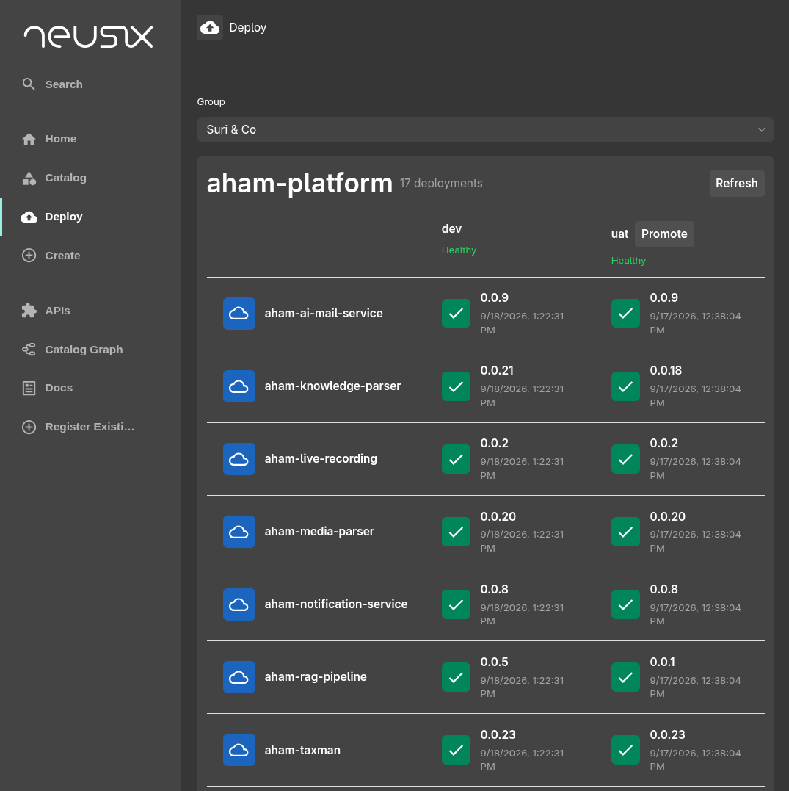

I built a continuous deployment UI with Backstage which uses Kargo and Gitlab CI behind the scenes.

Compared to our previous approach, this is has:

- Better visiblity of current deployments and what version is running
- One UI to manage Gitlab and Kargo (Kubernetes)
- Increased speed of deployment
- Self service promotion for anyone

Our earlier approach we had to use Gitlab CI pipelines and Kargo to promote one by one.

## Backstage

We choose Backstage because of speed of development with AI and CNCF backed framework. I am also going to develop
and maintain a public Gitlab plugin for Backstage (coming soon).
