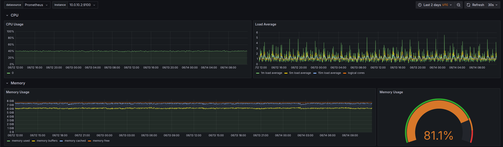
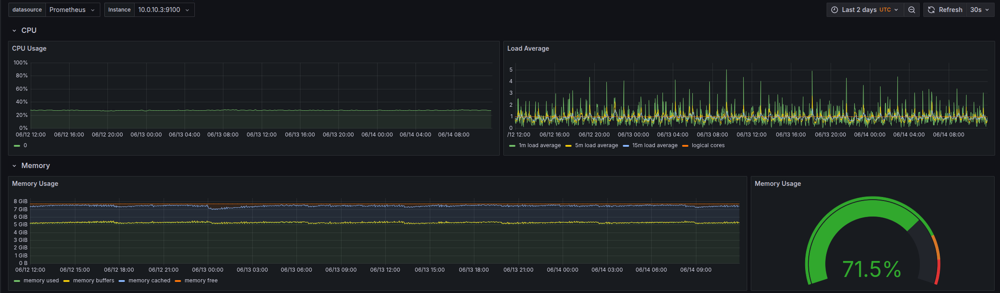
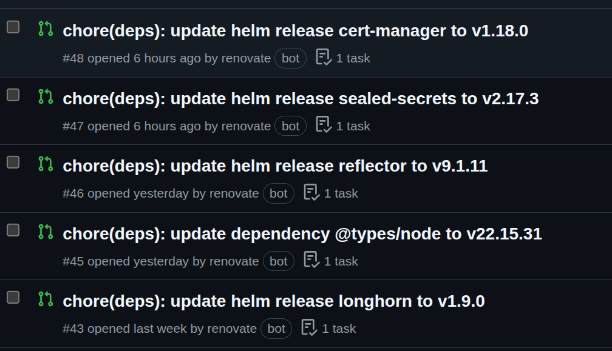

**Discussion Links**: [r/devops]() | [r/kubernetes]()

## Takeaway

* Learn to run a highly available Kubernetes cluster for free.
* Learn about Oracle Cloud Infrastructure and its Free Tier.
* Learn about Infrastructure as Code tools like Terraform and Pulumi.
* Learn to configure Oracle Bastion with Terraform for secure access to a private Kubernetes Cluster.
* Learn to set up Talos Linux with Longhorn.
* Learn to automate everything in one command using [taskfile](https://taskfile.dev).

In this article, I will show you how to create a free, production-ready, highly available, private Kubernetes cluster in one command using Infrastructure as Code tools.

## Why I choose Oracle Cloud?

* **Best Free Tier Among Cloud Providers:** I will explain why Oracle Cloud Infrastructure (OCI) offers a highly competitive and generous Free Tier compared to other cloud providers.
* **Cost-Effective Production Services:** Learn how OCI can be a viable option for running production-grade services at low costs, even beyond the Free Tier.
* **Transferable Cloud Skills:** Discover how gaining experience with OCI provides valuable and transferable skills applicable to other hyperscale cloud providers like AWS, Google Cloud Platform (GCP), and Azure.
* **Free Access to a Hyperscale Cloud:** Understand how to leverage OCI's Free Tier to gain hands-on experience with a powerful, enterprise-grade cloud environment without incurring significant costs.

## What is a hyperscaler?

In my opinion, **hyperscalers** are cloud providers offering more than 20 services, featuring robust authentication, comprehensive API access, and strong support for Infrastructure as Code tools like Terraform.

Ideally, hyperscalers should provide a diverse range of compute and storage options. This includes offerings like serverless functions, virtual machines (VMs), and containers, alongside various storage types such as S3-compatible object storage and different disk options like SSD, NVMe, and HDD.

Additionally, hyperscalers typically offer long-term commitment discounts, making them more cost-effective for sustained usage.

Examples of hyperscalers include AWS, Google Cloud, Azure, OVH Cloud, and Oracle.

## Oracle Free Tier Explained

Oracle Cloud Infrastructure (OCI) stands out with one of the most generous free tiers among all cloud providers. It offers two distinct types of free tiers:

* **Always Free:** These resources are free for the entire lifetime of your OCI account.
* **Free Tier:** These resources are free for a period of 12 months.

For our purposes, the **Always Free Compute Resources** are particularly important. This includes a 3,000 OCPU hours and 18,000 GB hours of RAM per month for ARM virtual machines (VMs), along with two AMD-based compute VMs of the `VM.Standard.E2.1.Micro` shape.

> **Important Considerations for Region Selection:**
>
> When setting up your Oracle Cloud account, choose your regions carefully, as **you cannot add or change them later.** Additionally, your **home region** is where you can provision Always Free resources, so select it wisely.

You have the flexibility to allocate these resources as you see fit. For instance, in this setup, we're utilizing two VMs with 6GB RAM and 1 VCPU each, and one VM with 6GB RAM and 2VCPUs.

Based on the Oracle Price Calculator, which caps the maximum number of hours per month at 720, this configuration translates to:

- 4 VCPUs x 720 hours/month = **2880 OCPU hours**
- 24 GB RAM x 720 hours/month = **17280 GB hours**

## Why not OCI Kubernetes Engine (OKE)?

While using a cloud provider's managed services is often recommended, I opted for **Talos Linux** over Oracle Kubernetes Engine (OKE) managed nodes for a few key reasons:

* **Seamless Upgrades:** Talos Linux allows for **in-place upgrades** of existing nodes, which means you can update your cluster without deleting and recreating nodes. This simplifies maintenance and reduces downtime.
* **Optimized Resource Usage:** OKE's managed nodes run Oracle Linux, which consumed **more RAM** than necessary. Talos Linux, being a minimal OS, is much more resource-efficient, freeing up valuable memory for your applications.
* **Greater Customization:** OKE's managed nodes offer **less flexibility** in terms of node specifications. With Talos Linux, you have more control to customize your node's resources to perfectly match your workload requirements. Like have a single node with more VCPU and keep the rest same.

## Why Talos Linux?

- Truly immutable, hardened by default (i.e, no SSH).
- Built for Kubernetes; no need to manage OS dependencies.
- Supports most cloud providers and bare metal workloads.
- Easy Kubernetes upgrades.
- Built-In Infrastructure as Code support with Terraform.

## Prerequisites

- Download a Talos Linux image from https://factory.talos.dev/ and upload it to Oracle Cloud Custom Images.
- Oracle Cloud API Key authentication setup for Terraform. Public & private key should be downloaded on your machine.

## Architecture diagram


All Load Balancers are Layer 4 because Layer 7 Load Balancers are significantly more expensive. Layer 4 Load Balancers, in contrast, are free. Only ports 80 and 443 are publicly exposed to the internet. The source code can be found on my GitHub, linked in the references.

## Setting up Terraform

Terraform is an Infrastructure as Code tool to provision resources that uses the language agnostic HashiCorp Configuration Language. We will use it along with Oracle's and Talos Linux's official Terraform provider.

Here we have setup API key authentication with Oracle Cloud and setup Talos Linux's provider.

```hcl
terraform {
  backend "oci" {
    bucket            = "terraform-state"
    namespace         = "bm0qttjfmooj"
  }
  required_providers {
    talos = {
      source  = "siderolabs/talos"
      version = "0.8.1"
    }
    oci = {
      source  = "oracle/oci"
      version = "7.4.0"
    }
  }
}
provider "talos" {
}
// Oracle
variable "user_ocid" {
}
variable "fingerprint" {
}
variable "tenancy_ocid" {
}
variable "region" {
  default = "ap-mumbai-1"
}
variable "private_key_path" {
  default = ""
}
variable "compartment_ocid" {
}
provider "oci" {
  region           = var.region
  tenancy_ocid     = var.tenancy_ocid
  user_ocid        = var.user_ocid
  fingerprint      = var.fingerprint
  private_key_path = var.private_key_path
}
```

### Setting up VMs

We are going to create 3 VMs for a highly available setup using Terraform with a Talos Linux image that we uploaded to OCI.

```hcl
resource "oci_core_instance" "controlplane" {
  count = var.control_plane_count

  availability_domain = data.oci_identity_availability_domain.ad.name
  compartment_id      = var.compartment_ocid
  display_name        = "bom-talos-${count.index + 1}"
  shape               = var.instance_shape
  fault_domain        = "FAULT-DOMAIN-${count.index + 1}"

  shape_config {
    ocpus         = count.index + 1 == var.control_plane_count ? 2 : var.instance_ocpus
    memory_in_gbs = var.instance_shape_config_memory_in_gbs
  }

  create_vnic_details {
    subnet_id        = oci_core_subnet.nodes.id
    display_name     = "primaryvnic"
    assign_public_ip = false
    hostname_label   = "bom-talos-${count.index + 1}"
    private_ip       = "10.0.10.${count.index + 2}"
  }

  source_details {
    source_type = "image"
    source_id   = var.talos_image_ocid
  }

  metadata = {
    user_data = base64encode(data.talos_machine_configuration.this.machine_configuration)
  }
}
```

### Talos Linux Terraform

Let's take a look at the Talos Linux configuration; there are two important parts we've set.

First, we've configured the `certSANs` for both the cluster and the machines to include `127.0.0.1`. This allows us to authenticate with the Kubernetes API when we port forward it, as the server only verifies if the connecting IP's subject matches and doesn't pose any security risk.

Secondly, we've set numerous fields to support Longhorn, which were copied directly from its documentation.

Additionally, we've configured the NTP server to Oracle's highly available NTP server, `169.254.169.254`.

We are also installing the metrics server as part of this setup.

```hcl
data "talos_machine_configuration" "this" {
  cluster_name     = var.cluster_name
  machine_type     = "controlplane"
  cluster_endpoint = "https://${local.endpoint}:6443"
  machine_secrets  = talos_machine_secrets.this.machine_secrets

  config_patches = [
    yamlencode({
      machine = {
        certSANs = [local.endpoint]
        time = {
          servers = ["169.254.169.254"]
        }
        sysctls = {
          "vm.nr_hugepages" = 1024
        }
        kernel = {
          modules = [{ name = "nvme-tcp" }, { name = "vfio_pci" }]
        }
        kubelet = {
          extraArgs = {
            "rotate-server-certificates" = true
          }
          extraMounts = [
            {
              destination = "/var/lib/longhorn"
              type        = "bind"
              source      = "/var/lib/longhorn"
              options     = ["bind", "rshared", "rw"]
            }
          ]
        }
      }
      cluster = {
        allowSchedulingOnControlPlanes = true
        extraManifests = [
          "https://raw.githubusercontent.com/alex1989hu/kubelet-serving-cert-approver/main/deploy/standalone-install.yaml",
          "https://github.com/kubernetes-sigs/metrics-server/releases/latest/download/components.yaml"
        ]
        apiServer = {
          certSANs = [local.endpoint]
        }
      }
    })
  ]
}
```

### Load Balancers

We need to create 2 private Load Balancers: Talos, Kubernetes API and one publicly exposed Load Balancer for our Ingress. As I said before we are going to create Layer 4 Load Balancers so we need to have a certificate and open ports on every node.

I am using the `NodePort` of Traefik to forward traffic from the Layer 4 Load Balancer. Here is an example for our private Load Balancer for Talos:

```hcl
resource "oci_network_load_balancer_network_load_balancer" "talos" {
  compartment_id = var.compartment_ocid
  display_name   = "talos"
  subnet_id      = oci_core_subnet.loadbalancers.id
  is_private     = true # Make the load balancer private

  assigned_private_ipv4 = "10.0.60.200"
}
```

Our public Load Balancer for Internet Traffic with IPv6:

```hcl
resource "oci_network_load_balancer_network_load_balancer" "traefik_nlb" {
  compartment_id = var.compartment_ocid
  display_name   = "traefik_ingress_nlb"
  subnet_id      = oci_core_subnet.public_lbs.id
  is_private     = false # Make the load balancer private
  nlb_ip_version = "IPV4_AND_IPV6"

  assigned_ipv6 = cidrhost(oci_core_subnet.public_lbs.ipv6cidr_block, 200)
}
```

Our setup is now highly available so even if one node fails there is no downtime.

### Security

Security is very simple, we only expose the ports we need. All egress traffic is allowed and all traffic inside our private nodes subnet is allowed. Here is an example:

```hcl
resource "oci_core_security_list" "loadbalancers_sec_list" {
  compartment_id = var.compartment_ocid
  vcn_id         = oci_core_virtual_network.talos_vcn.id
  display_name   = "Private Load Balancer security list"

  # IPv4: Allow all egress traffic
  egress_security_rules {
    protocol    = "all"
    destination = "0.0.0.0/0"
  }

  # IPv4: Allow Talos from Bastion
  ingress_security_rules {
    protocol = "6"
    source   = "10.0.30.0/24"

    tcp_options {
      max = "50000"
      min = "50000"
    }
  }

  # IPv4: Allow K8S from Bastion
  ingress_security_rules {
    protocol = "6"
    source   = "10.0.30.0/24"

    tcp_options {
      max = "6443"
      min = "6443"
    }
  }
}
```

### Automating SSH Port Forwarding with OCI Bastion

Now comes the important part: to automate port forwarding, I utilized the SSH multiplexing feature. This allowed me to create SSH port forwarding sessions in the background without the command being in the foreground indefinitely and exit them cleanly if needed without shell scripting.

The `command` is simply quitting any existing session and then creating a new one. This handles cases where a session might exist but the connection is not properly established.

I used `timestamp()` to **ALWAYS** run the port forwarding command to handle cases where the infrastructure is up to date but we need to rerun the port forwarding command. This is the reason we are using `null_resource` so it can re-run independently.

As an example to port forward the Talos API server:

```hcl
resource "null_resource" "talos" {
  depends_on = [oci_bastion_session.talos_session]
  triggers = {
    always_run = "${timestamp()}"
  }
  provisioner "local-exec" {
    command = "ssh -S bastion_session_talos -O exit ${local.talos_bastion_user}; ssh -M -S bastion_session_talos -fNL 50000:10.0.60.200:50000 ${local.talos_bastion_user}"
  }
}
```

Now that our production-ready highly available private Kubernetes cluster is ready we can start installing some stuff.

## Bootstrapping ArgoCD

I used Pulumi to bootstrap ArgoCD because I wanted to convert my existing Terraform code to Pulumi in the future so I can programmatic port forward using a library from a real programming language instead of relying on shell commands.

First we just install ArgoCD then we apply our ArgoCD app of apps root application.

```ts
import * as k8s from "@pulumi/kubernetes";

const argoCD = new k8s.kustomize.v2.Directory("argoCDKustomize", {
  directory: "./bootstrap",
});
const argoCDRootApp = new k8s.yaml.v2.ConfigFile(
  "argocd-root-app",
  {
    file: "../../root-argocd-app.yaml",
  },
  { dependsOn: [argoCD] }
);
```

Bootstrap directory just has a kustomization file with a manifest pointing to ArgoCD installation.

```yaml
# kustomization.yaml
apiVersion: kustomize.config.k8s.io/v1beta1
kind: Kustomization

namespace: argocd
resources:
- ./ns.yaml
- https://raw.githubusercontent.com/argoproj/argo-cd/v3.0.2/manifests/install.yaml
```

```yaml
# ns.yaml
apiVersion: v1
kind: Namespace
metadata:
  name: argocd
```

## Automating everything with one command

To have one command setup everything: Terraform -> Pulumi -> storing kubeconfig & talosconfig I am using [taskfile](https://taskfile.dev/).

```yaml
tasks:
  default:
    cmds:
      - terraform apply -auto-approve
      - task: configs
    silent: true
  configs:
    cmds:
      - terraform output -raw talosconfig > ./talosconfig
      - terraform output -raw kubeconfig > ./kubeconfig
      - mv ./kubeconfig ~/.kube/config
```

## Resource Usage

The cluster is just running Traefik, Sealed Secrets, Reflector, Longhorn, kube-prometheus-stack, External Secrets, Cloudnative PG, cert-manager and ArgoCD.

Additionally there is a single Laravel app deployed with staging and prod environments.

I have attached the screenshots of Node Exporter of each node:






## Upgrading

### Kubernetes & Talos

Not yet tested. Will update the article once I test it.

### Apps & Dependencies

I use [Renovate](https://docs.renovatebot.com/) to keep my dependencies up to date. Nothing more to say, it works really well with Infrastructure as Code tools.



## Future improvements

- Migrate Terraform to Pulumi.
- Remove dependency of uploading Talos Linux image.
- Use a library to programmatically port forward using OCI Bastion. 
- Fully automated ArgoCD with sync waves for COMPLETELY automated bootstrap and deployment.
- Making ArgoCD environment adaptable for other people like easily change domain and it should work.

## References

- [https://github.com/navaneeth-dev/public-gitops/tree/main/infrastructure](https://github.com/navaneeth-dev/public-gitops/tree/main/infrastructure)
- https://codefresh.io/blog/how-to-structure-your-argo-cd-repositories-using-application-sets/