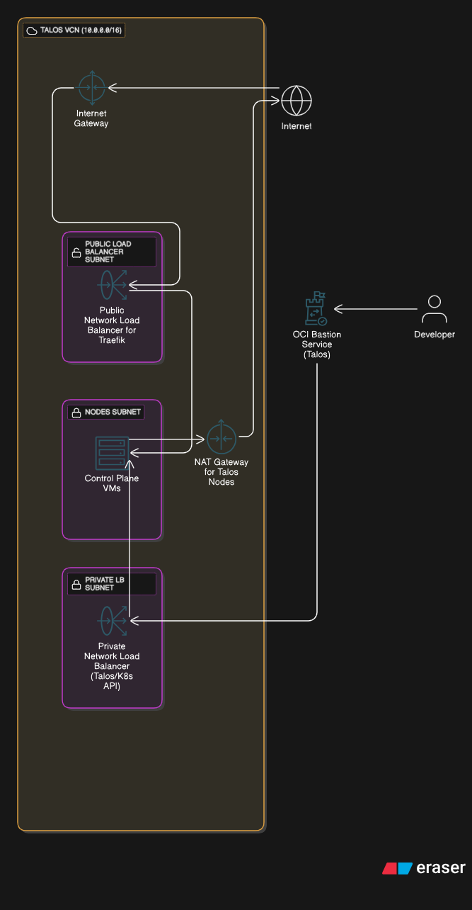

**Discussion Links**: [r/devops]() | [r/kubernetes]()

## Takeaway

- Learn to run a highly available Kubernetes cluster for free.
- Learn about Oracle Cloud Infrastructure and its Free Tier.
- Learn about Infrastructure as Code tools like Terraform and Pulumi.
- Learn to configure Oracle Bastion with Terraform to securely access a private Kubernetes Cluster.
- Learn to setup Talos Linux with Longhorn.

## Why I choose Oracle Cloud?

- Best Free Tier among any cloud provider which I will explain below.
- Good for running production-grade services for low costs.
- Transferable skills to other hyperscalers like AWS, GCP, etc.
- Get to work with a Hyperscale Cloud for free.

## What is a hyperscaler?

In my opinion Hyperscalers are Cloud providers with more than 20+ services which include strong authentication and API access and good support for Terraform.

Hyperscalers should ideally have various compute and storage options like Serverless, VMs, Containers, S3, Different Storage types like SSD, NVME, HDD, etc.

Hyperscalers usually also have long term commitment discounts.

Examples: AWS, Google Cloud, Azure, OVH Cloud, Oracle, etc.

## Oracle Free Tier Explained

Oracle Cloud has one of the best free tiers of any cloud provider. There are two free tier types:

- Always Free (free for life)
- Free Tier (12 months)

The important resources to us is the Always Free Compute Resource which includes 3,000 OCPU hours and 18,000 GB hours per month (RAM) for ARM VMs and 2 AMD based compute VMs of `VM.Standard.E2.1.Micro` shape.

> Choose your regions carefully in Oracle you **CANNOT** add or change it later.
> Also choose your home region carefully that is where you can create Always Free resources.

You can split it up however you like, in this setup I am using 2 VMs with 6GB RAM, 1 VCPU and 1 VM with 6GB RAM and 2VCPU.

So according to Oracle Price Calculator which caps the maximum number of hours per month to 720.  
4 x 720 = **2880 OCPU hours**.  
8 x 3 x 720 = **17280 GB hours**.

## Why not OCI Kubernetes Engine (OKE)?

This is a good question whenever we use a cloud provider we should always try to stick to their managed services, but I found upgrading with Talos Linux better because you can upgrade the existing node easily without deleting an existing node.

OKE managed nodes was using Oracle Linux which was eating up more RAM.

Can't customize node specs using OKE -> less flexiable.

## Why Talos Linux?

- Truly immutable, hardened by default (i.e no ssh).
- Built for Kubernetes, no need to manage OS dependencies.
- Supports most cloud providers and bare metal workloads.
- Easy Kubernetes upgrades.
- Infrastructure as Code.

```hcl
data "talos_machine_configuration" "this" {
  cluster_name     = var.cluster_name
  machine_type     = "controlplane"
  cluster_endpoint = "https://${local.endpoint}:6443"
  machine_secrets  = talos_machine_secrets.this.machine_secrets

  config_patches = [
    yamlencode({
      machine = {
        certSANs = [local.endpoint]
        time = {
          servers = ["169.254.169.254"]
        }
        sysctls = {
          "vm.nr_hugepages" = 1024
        }
        kernel = {
          modules = [{ name = "nvme-tcp" }, { name = "vfio_pci" }]
        }
        kubelet = {
          extraArgs = {
            "rotate-server-certificates" = true
          }
          extraMounts = [
            {
              destination = "/var/lib/longhorn"
              type        = "bind"
              source      = "/var/lib/longhorn"
              options     = ["bind", "rshared", "rw"]
            }
          ]
        }
      }
      cluster = {
        allowSchedulingOnControlPlanes = true
        extraManifests = [
          "https://raw.githubusercontent.com/alex1989hu/kubelet-serving-cert-approver/main/deploy/standalone-install.yaml",
          "https://github.com/kubernetes-sigs/metrics-server/releases/latest/download/components.yaml"
        ]
        apiServer = {
          certSANs = [local.endpoint]
        }
      }
    })
  ]
}
```

## Architecture Diagram



All Load Balancers are Layer 4 because Layer 7 Load Balancers cost a lot. Only 443 and 80 ports are exposed publicly to the internet. The source code can be found on my GitHub linked below.

## Longhorn


## Upgrading Kubernetes

upgrades

## References

[github.com/navaneeth-dev/public-gitops/](https://github.com/navaneeth-dev/public-gitops/tree/main/infrastructure)