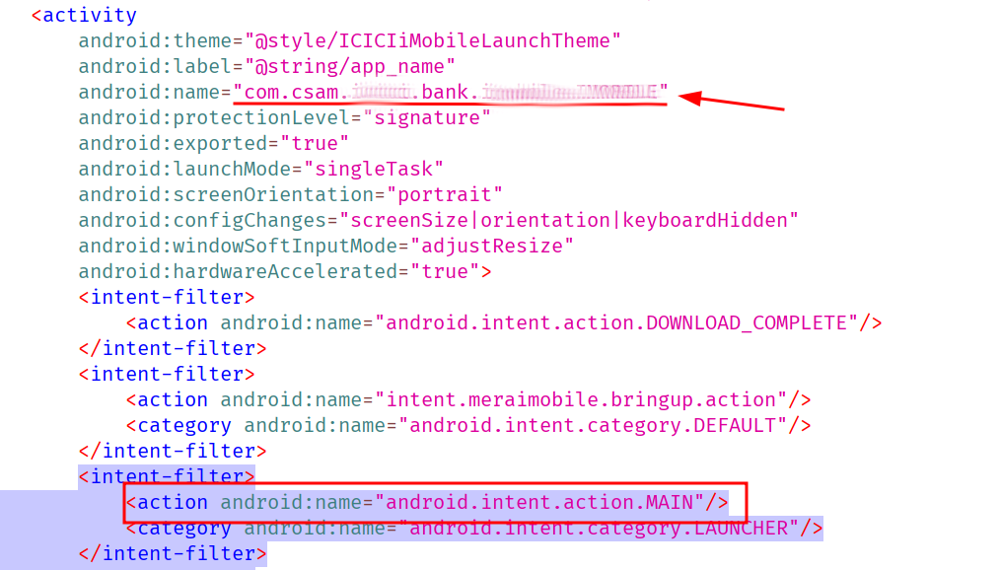
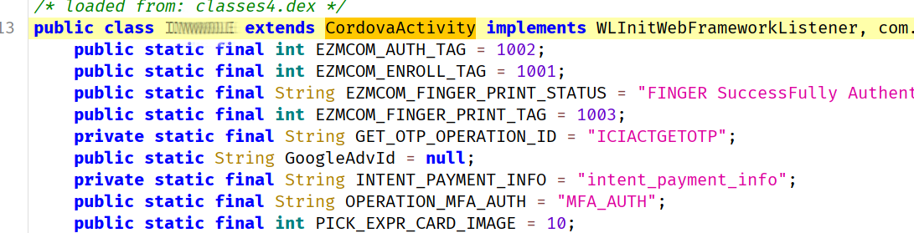
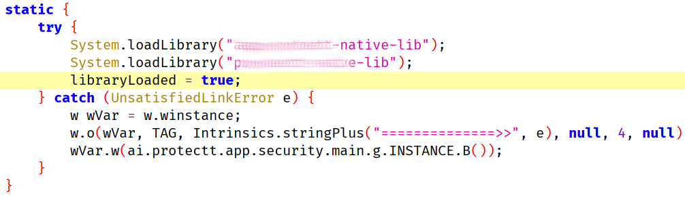
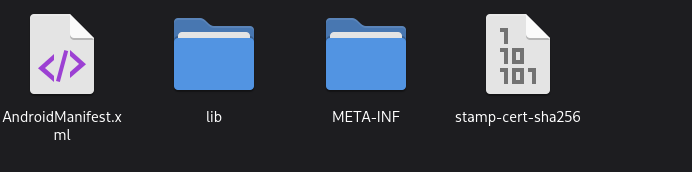
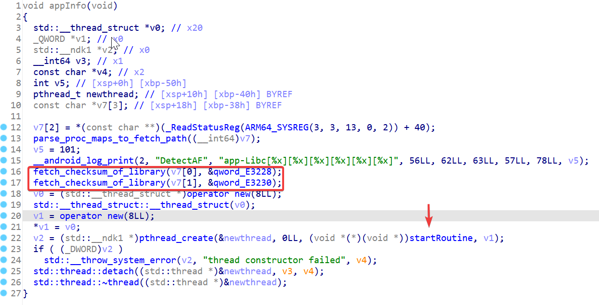
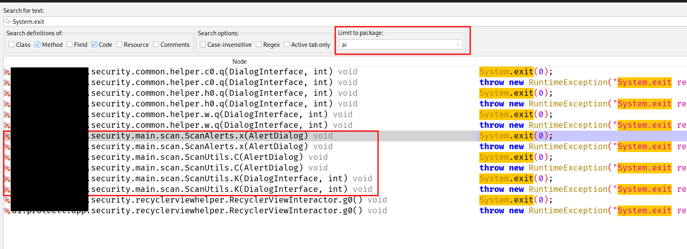
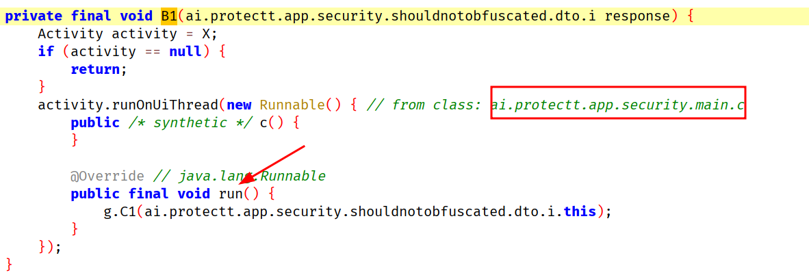
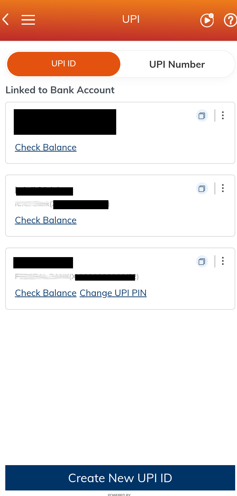

**Discussion links:** [Reddit]() | [Hacker News]()

## Takeaway

- Get a custom UPI VPA / UPI ID like `anything@icici`.
- Learn how to bypass Bypass Protectt.AI.
- Learn how to bypass Anti-Frida measures.
- Learn how to reverse engineering Android native libraries.

My goal in starting this project was to create custom payment IDs where it would otherwise not have been possible. Advantages of having a short UPI ID include ease of remembering, an inside joke for friend groups and simpler to communicate. So what is UPI ID and ICICI's iMobile Pay?

## UPI

Unified Payments Interface is an Indian instant payment system as well as **protocol** developed by the National Payments Corporation of India (NPCI). Everyone in India use UPI for day to day payments, nobody uses cards for payments.

UPI allows every bank (ICICI, Federal Bank) and third-party apps (GPay, PhonePe) to interact with each other.

So what is UPI ID? It is an alias for your bank account. In the case of ICICI bank app, we can have one UPI ID link to another bank for example: ICICI UPI ID for Federal Bank. A person can have several UPI IDs, for example one UPI ID for each app.

## iMobile Pay

This is the official mobile banking app for ICICI bank in India. While exploring the app I saw it has the ability to create new UPI IDs but you can only choose from the list.


## Initial analysis

Now that I know we have the ability to choose the UPI IDs, I thought we can intercept the request and change the UPI ID to our desired one. With this I started analyzing the APK. First thing I always do is open JADX-GUI and look at the AndroidManifest.xml and MainActivity. To get the APK I used adb pull.



The MainActivity extends `CordovaActivity` which means it's a React Native app, another way to find out if it's a React Native app is to check for the presence of `index.android.bundle`.



## Attempting to locate Anti-Frida detection 

After understanding what type of APK I will be dealing with, I started dynamic analysis with Frida so that I can easily verify if I am looking at the correct class from JADX. First thing I noticed after launching the app with Frida is the Frida connection closes immediately.


So this indicates Anti-Frida techniques. To trace which part of the code the Anti-Frida code is located I started hooking interesting functions which is called early. I used `Thread.sleep(10)` to check if the connection closes after 5 seconds that means the Anti-Frida code was already called before the hook. I also used `frida-trace -j 'CLASS!FUNCTION'` to check if a function is being called in the first place.

After doing this for sometime I found that after `System.loadLibrary` is called the connection immediately closes. So this means a native library is doing the Anti-Frida stuff. Also I would always encounter a crash after hooking `System.loadLibrary` because of [this](https://github.com/rovo89/XposedBridge/issues/87):

> This is one of the methods that you shouldn't hook. Have a look at the implementation: [https://android.googlesource.com/platform/libcore/+/android-6.0.1_r16/luni/src/main/java/java/lang/System.java#1072](https://android.googlesource.com/platform/libcore/+/android-6.0.1_r16/luni/src/main/java/java/lang/System.java#1072)
> 
> It uses the class loader of the caller, which is usually the app, but would be Xposed as soon as you hook it. Please hook Runtime.loadLibrary() instead.



Now while I was running this in an Android 11 emulator I was not able to get the base address of the loaded module via `Process.findModuleByName` (which I was using to check whether the library was loaded fully so I can hook it's functions) but the library was loaded in memory with no module name. I suspect it's because of ARM translation going on and it was doing some sort of manual mapping. The APK only had arm64-v8a native libraries and no x86_64 library which was my emulator's architecture.

So going forward I did all my testing in my real Android device with MagiskHide turned off otherwise you cannot do early-instrumentation with `frida -U -f <launch-app>`.

In my real device I was able to hook `System.loadLibrary` and get the base address of the module right after it's been loaded. Example code:

```js
Java.perform(function() {
    const System = Java.use('java.lang.System');
    const Runtime = Java.use('java.lang.Runtime');
    const SystemLoad_2 = System.loadLibrary.overload('java.lang.String');
    const VMStack = Java.use('dalvik.system.VMStack');

    SystemLoad_2.implementation = function(library) {
        send("Loading dynamic library => " + library);
        try {
            const loaded = Runtime.getRuntime().loadLibrary0(VMStack.getCallingClassLoader(), library);
            if(library === 'protectt-native-lib') {
				// hook native lib functions
            }
            return loaded;
        } catch(ex) {
            console.log(ex);
        }
    };
});
```


Now that we have the ability to hook functions right after the native library is loaded. We can start reverse engineering the native library.

## Protectt.AI

The library responsible for closing the Frida connection is `libprotectt-native-lib.so`, so what is this native library? It is a RunTime Application Self-Protection solution developed by [Protectt.AI](https://www.protectt.ai/).

> Protectt ai Pvt Ltd is a Mobile Threat Defense (MTD) cyber-security organization building the next generation Mobile App, Device & Transaction security solution driven by Deep Tech.


Other native libraries important in ICICI bank app:

| Name                          | Description                        |
| ----------------------------- | ---------------------------------- |
| libprotectt-native-lib.so     | Main module                        |
| libapp-protectt-native-lib.so | Rest of libprotectt, not important |
| libnative-lib.so              | Gets API URL, not important        |

## Extracting native libraries

To reverse engineer the native library I first have to get the .so files. First I checked the unzipped apk and didn't find any lib folder. After lots of research I found out about split apks and extractNativeLibs.

`android:extractNativeLibs="false"` means the main APK won't store any libraries but will instead store native libraries in architecture specific APKs to save download bandwidth.


*AndroidManifest.xml*

How to get split APK?

```bash
$ adb shell pm path com.csam.icici.bank.imobile
package:/data/app/~~UOYiAXaSPBW0Ae8atXOrqg==/com.csam.icici.bank.imobile-SYp1oonK6muaef0keHyLGw==/base.apk
package:/data/app/~~UOYiAXaSPBW0Ae8atXOrqg==/com.csam.icici.bank.imobile-SYp1oonK6muaef0keHyLGw==/split_config.arm64_v8a.apk <-- EXTRACT THIS
package:/data/app/~~UOYiAXaSPBW0Ae8atXOrqg==/com.csam.icici.bank.imobile-SYp1oonK6muaef0keHyLGw==/split_config.xxhdpi.apk
```

Now we can just adb pull and the unzipped directory should have the libraries uncompressed.




## Reverse engineering Android native libraries

After loading `libprotectt-native-lib.so` binary in IDA, (which I knew from my loadLibrary hook) I jumped into the entry point and found a thread being created with a startRoutine. It always verifies the checksum of the native library.



The startRoutine finally calls the `F1` function which is just an infinite loop that calls two functions if the app is being used. If not it sleeps using the function `nanosleep` and checks again.


### Function 1 reversed

With the help of ChatGPT I was able to find out what this function does pretty fast. This function checks all thread names of the process via `/proc/self/task/%s/status` if it matches any of these:

- gmain
- gum-js-loop

If it does it calls it's exitClause which in turn calls `exit(1)` and does other things which is not very important.

It also checks if `strstr` or `opendir` has been hooked by comparing bytes with `libc.so` on disk.

```c
__int64 mwMainThread()
{
  ...omitted for brevity
  v73 = *(_QWORD *)(_ReadStatusReg(ARM64_SYSREG(3, 3, 13, 0, 2)) + 40);
  v0 = rotMinus2("/rtqe/ugnh/vcum==");
  dirPtr = opendir(v0);
  if ( !dirPtr )
  {
    if ( check_open()
      || (v50 = rotMinus2("qrgpfkt=="), checkForFunctionHook(v50)) // opendir
      || (v51 = rotMinus2("uvtuvt=="), success = checkForFunctionHook(v51), (success & 1) != 0) ) // strstr
    {
      __android_log_print(4, "AppProtectt", "G-M..1.1");
      v53 = "et";
exitClause:
      callScanCore(v53);
      parse_maps_and_change_permissions();
      exit(1);
    }
    goto LABEL_80;
  }
  v2 = dirPtr;
  v3 = readdir(dirPtr);
  if ( v3 )
  {
    v54 = 0;
    while ( 1 )
    {
      v4 = v3->d_name;
      v6 = v3->d_name;
      v7 = ".";
	  ...omitted
      while ( 1 )
      {
        v8 = (unsigned __int8)*v6;
        if ( v8 != (unsigned __int8)*v7 )
          break;
        ++v7;
        ++v6;
        if ( !v8 )
          goto LABEL_8;
      }
      v9 = v3->d_name;
      v10 = "..";
      while ( 1 )
      {
        v11 = (unsigned __int8)*v9;
        if ( v11 != (unsigned __int8)*v10 )
          break;
        ++v10;
        ++v9;
        if ( !v11 )
          goto LABEL_8;
      }
      procSelfTaskStatusFmtStr = rotMinus2("/rtqe/ugnh/vcum/%u/uvcvwu==");
      formatStr((__int64)taskSelfFmtBuf, 256LL, 256LL, procSelfTaskStatusFmtStr, v4);
      v13 = linux_eabi_syscall(__NR_openat, -100, (const char *)taskSelfFmtBuf, 0x80000);
      if ( v13 )
      {
        v14 = buffer;
		...omitted
        *(_OWORD *)buffer = 0u;
        v57 = 0u;
        do
        {
          *v14 = 0;
          v15 = v14 + 1;
          if ( v15 >= (_BYTE *)taskSelfFmtBuf )
            break;
          *v15 = 0;
          v16 = v15 + 1;
          if ( v16 >= (_BYTE *)taskSelfFmtBuf )
            break;
          *v16 = 0;
          v17 = v16 + 1;
          if ( v17 >= (_BYTE *)taskSelfFmtBuf )
            break;
          *v17 = 0;
          v14 = v17 + 1;
        }
        while ( v14 < (char *)taskSelfFmtBuf );
        for ( i = 0LL; i != 255; ++i )
        {
          if ( read(v13, buf, 1u) != 1LL )
            break;
          if ( buf[0] == 10 )
            break;
          buffer[i] = buf[0];
        }
        gumJsLoop = rotMinus2("iwo-lu-nqqr=="); // gum-js-loop
        gmain = rotMinus2("iockp==");           // gmain
        v21 = gumJsLoop + 1;
        if ( !*gumJsLoop )
          goto gumExitClause;
        if ( *v21 )
        {
          v22 = 0LL;
          do
          {
            v23 = (unsigned __int8)gumJsLoop[v22 + 2];
            v24 = ++v22;
          }
          while ( v23 );
        }
        else
        {
          v24 = 0LL;
        }
        readBuf = buffer;
        while ( 1 )
        {
          readBufCpy = readBuf;
          currentCharRefBuf = (unsigned __int8)*readBuf++;
          currentCharRefBufCpy = currentCharRefBuf;
          if ( !currentCharRefBuf )
            break;
          if ( currentCharRefBufCpy == (unsigned __int8)*gumJsLoop )
          {
            if ( !v24 )
              goto gumExitClause;
            v29 = 0LL;
            while ( readBufCpy[v29 + 1] == v21[v29] )
            {
              if ( readBufCpy[v29 + 1] )
              {
                if ( v24 != ++v29 )
                  continue;
              }
              goto gumExitClause;
            }
          }
        }
        gmainPtr = gmain + 1;
        if ( !*gmain )
        {
gumExitClause:
          FK[0] = "GA";
          __android_log_print(4, "AppProtectt", "G-M..1");
          v53 = "gum";
          goto exitClause;
        }
        if ( *gmainPtr )
        {
          i_1 = 0LL;
          do
          {
            gmainChar = (unsigned __int8)gmain[i_1 + 2];
            v33 = ++i_1;
          }
          while ( gmainChar );
        }
        else
        {
          v33 = 0LL;
        }
        v34 = buffer;
        while ( 1 )
        {
          v35 = v34;
          v37 = (unsigned __int8)*v34++;
          v36 = v37;
          if ( !v37 )
            break;
          if ( v36 == (unsigned __int8)*gmain )
          {
            if ( !v33 )
              goto gumExitClause;
            v38 = 0LL;
            while ( v35[v38 + 1] == gmainPtr[v38] )
            {
              if ( v35[v38 + 1] )
              {
                if ( v33 != ++v38 )
                  continue;
              }
              goto gumExitClause;
            }
          }
        }
        close(v13);
      }
      if ( (v54 & 1) == 0 )
      {
        pid = getpid();
        formatStr((__int64)buffer, 32LL, 32LL, "%d", pid);
        if ( buffer[0] )
        {
          if ( buffer[1] )
          {
            v40 = 0LL;
            do
            {
              v41 = (unsigned __int8)buffer[v40 + 2];
              v42 = ++v40;
            }
            while ( v41 );
          }
          else
          {
            v42 = 0LL;
          }
          while ( 1 )
          {
            v43 = v4;
            v45 = (unsigned __int8)*v4++;
            v44 = v45;
            if ( !v45 )
              break;
            if ( v44 == (unsigned __int8)buffer[0] )
            {
              if ( !v42 )
              {
LABEL_4:
                v4 = v43;
                goto LABEL_5;
              }
              v46 = &buffer[1];
              v47 = v4;
              v48 = v42;
              while ( 1 )
              {
                v49 = (unsigned __int8)*v46++;
                if ( (unsigned __int8)*v47 != v49 )
                  break;
                if ( *v47 )
                {
                  --v48;
                  ++v47;
                  if ( v48 )
                    continue;
                }
                goto LABEL_4;
              }
            }
          }
          v4 = 0LL;
        }
LABEL_5:
        v5 = v54;
        if ( v4 )
          v5 = 1;
        v54 = v5;
      }
LABEL_8:
      v3 = readdir(v2);
      if ( !v3 )
        goto LABEL_79;
    }
  }
  LOBYTE(v54) = 0;
LABEL_79:
  success = closedir(v2);
  if ( (v54 & 1) == 0 )
  {
LABEL_80:
    if ( info1[0] == "not found" )
      info1[0] = "LEO";
  }
  return success;
}
```

### Function 2 reversed

This function is kinda of similar to the above function but checks if any file descriptor links to linjector. This is not important to Anti-Frida.

```cpp
__int64 sub_599EC()
{
  ...omitted for brevity
  v52 = *(_QWORD *)(_ReadStatusReg(ARM64_SYSREG(3, 3, 13, 0, 2)) + 40);
  v0 = rotMinus2("/rtqe/ugnh/hf==");
  v1 = opendir(v0);
  v2 = v1;
  if ( !v1 )
  {
    if ( check_open()
      || (v27 = rotMinus2("qrgpfkt=="), checkForFunctionHook(v27))
      || (v28 = rotMinus2("uvtuvt=="), checkForFunctionHook(v28)) )
    {
      __android_log_print(4, "AppProtectt", "L-J..1.1");
      v30 = "et";
exitClause:
      callScanCore(v30);
      parse_maps_and_change_permissions();
      exit(1);
    }
    goto successClause;
  }
  v3 = readdir(v1);
  if ( v3 )
  {
    v4 = v3;
    v5 = 0;
    while ( 1 )
    {
	  ...
      *(_OWORD *)file = 0u;
      v36 = 0u;
      v6 = rotMinus2("/rtqe/ugnh/hf/%u==");
      formatStr((__int64)file, 256LL, 256LL, v6, v4->d_name);
      lstat(file, (struct stat *)v31);
      if ( (v32 & 0xF000) == 40960 )
      {
        v7 = linux_eabi_syscall(__NR_readlinkat, -100, file, (char *)v51, 0x100u);
        linjector = rotMinus2("nkplgevqt==");
        if ( (v5 & 1) == 0 )
        {
          pid = getpid();
          formatStr((__int64)&buf, 32LL, 32LL, "%s%s%s%d%s", "pr", "oc", "/", pid, "/fd");
          if ( buf )
          {
			  ...omitted
          }
          else
          {
            v13 = v51;
          }
LABEL_22:
          if ( v13 )
            v5 = 1;
        }
        mwNulltermmaybe = linjector + 1;
        if ( !*linjector )
        {
exitClauseParent:
          FK[0] = "LFA";
          __android_log_print(4, "AppProtectt", "L-J..1");
          v30 = "lin";
          goto exitClause;
        }
        if ( *mwNulltermmaybe )
        {
          v19 = 0LL;
          do
          {
            v20 = (unsigned __int8)linjector[v19 + 2];
            v21 = ++v19;
          }
          while ( v20 );
        }
        else
        {
          v21 = 0LL;
        }
        v22 = v51;
        while ( 1 )
        {
          v23 = v22;
          v25 = *(unsigned __int8 *)v22;
          v22 = (__int128 *)((char *)v22 + 1);
          v24 = v25;
          if ( !v25 )
            break;
          if ( v24 == (unsigned __int8)*linjector )
          {
            if ( !v21 )
              goto exitClauseParent;
            v26 = 0LL;
            while ( *((unsigned __int8 *)v23 + v26 + 1) == (unsigned __int8)mwNulltermmaybe[v26] )
            {
              if ( *((_BYTE *)v23 + v26 + 1) )
              {
                if ( v21 != ++v26 )
                  continue;
              }
              goto exitClauseParent;
            }
          }
        }
      }
      v4 = readdir(v2);
      if ( !v4 )
        goto LABEL_45;
    }
  }
  v5 = 0;
LABEL_45:
  if ( (v5 & 1) == 0 )
  {
successClause:
    if ( globalStatus == "not found" )
      globalStatus = "LEO";
  }
  return closedir(v2);
}
```

## Bypassing native library checks

When checking my phone, I was being detected because Frida creates a gmain thread. There are many ways to bypass this but I just hooked these two functions.

The way I did that is by hooking  `pthread_create` and after registering the startRoutine hook, I hook the two functions. I just add an offset from the base address because this is a temporary project. After the library is loaded I unhook `pthread_create`.

```js
    let threadHook = null;
    const pthread_create_ptr = Module.findExportByName(null, "pthread_create");
    console.log("[+] Found pthread_create at: " + pthread_create_ptr);
    System.loadLibrary.implementation = function(library) {
        if (library == "protectt-native-lib") {
            threadHook = Interceptor.attach(pthread_create_ptr, {
                onEnter: function(args) {
                    this.threadPtr = args[0];
                    this.startRoutine = args[2];
                    this.routineArg = args[3];

                    // Hooking first startRoutine after libprotectt is loaded is enough
                    if (!hooked) {
                        const startRoutineHook = Interceptor.replace(this.startRoutine, new NativeCallback(() => {
                            console.log("[+] Thread function started");

                            var targetModule = Process.findModuleByName("libprotectt-native-lib.so");
                            if (targetModule) {
                                const baseAddr = targetModule.base;

                                Interceptor.replace(baseAddr.add(0x59E24), new NativeCallback(() => {
                                    console.log("[+] mainThread Hook");
                                }, 'void', []));

                                Interceptor.replace(baseAddr.add(0x599EC), new NativeCallback(() => {
                                    console.log("[+] mainThread2 Hook");
                                }, 'void', []));
                            }
                        }, 'void', ['pointer']));

                        hooked = true;
                        threadHook.detach();
                    }
                },
            });
        }

        Runtime.getRuntime().loadLibrary0(VMStack.getCallingClassLoader(), library);
        const classLoader = VMStack.getCallingClassLoader();

        if (library == "protectt-native-lib" && threadHook) {
            threadHook.detach();
            threadHook = null;
        }
    };
```

## Bypassing root detection

With this I was able to bypass the Anti-Frida detection but now I was getting root detected. 


So I tried searching for the string "Your Device is rooted. For security reasons..." in the APK but no results were found. I searched in `/data/data` and `/data/user` still no results.

With no luck I tried searching for "Close App" again no luck. I tried with case insensitive and partial strings like "Your Device" etc... Still no luck.

I decided to change my approach and search for Android APIs that exit the app, [Stackoverflow](https://stackoverflow.com/questions/17719634/how-to-exit-an-android-app-programmatically) has a good list.


- finishAffinity
- finishAndRemoveTask
- getActivity().finish();
- System.exit(0)

I tried searching for these with JADX code search and found a few interesting functions. It's likely only the main one's are relevant. And we focus our search inside the ai package.



After seeing a few of these functions there is a common function `companion.d()`. It's called by everything that closes the apps.


I hook this so I can see what exactly is calling it up the stack. So I can hook the parent function and bypass the root detection.

```js
let a = Java.use("ai.protectt.app.security.main.g$a");
a["d"].implementation = function () {
	console.log(`a.d is called`);
	let result = this["d"]();
	console.log(`a.d result=${result}`);
	console.log(Java.use("android.util.Log").getStackTraceString(Java.use("java.lang.Exception").$new()))
	return result;
};
```

Once we click "Close App" the last stack trace should give us the correct function. 

```bash
a.d is called
a.d result=[object Object]
java.lang.Exception
        at ai.protectt.app.security.main.g$a.d(Native Method)
        at ai.protectt.app.security.main.scan.ScanAlerts.x(Unknown Source:49)
        at ai.protectt.app.security.main.scan.ScanAlerts.V(Unknown Source:11)
        at ai.protectt.app.security.main.scan.ScanAlerts.d0(Unknown Source:3)
        at ai.protectt.app.security.main.scan.ScanAlerts.f(Unknown Source:0)
        at ai.protectt.app.security.main.scan.t.onClick(Unknown Source:4)
        at android.view.View.performClick(View.java:8028)
        at android.view.View.performClickInternal(View.java:8005)
        at android.view.View.-$$Nest$mperformClickInternal(Unknown Source:0)
        at android.view.View$PerformClick.run(View.java:31233)
        at android.os.Handler.handleCallback(Handler.java:959)
        at android.os.Handler.dispatchMessage(Handler.java:100)
        at android.os.Looper.loopOnce(Looper.java:258)
        at android.os.Looper.loop(Looper.java:356)
        at android.app.ActivityThread.main(ActivityThread.java:8837)
        at java.lang.reflect.Method.invoke(Native Method)
        at com.android.internal.os.RuntimeInit$MethodAndArgsCaller.run(RuntimeInit.java:598)
        at com.android.internal.os.ZygoteInit.main(ZygoteInit.java:896)
```


```js
ScanAlerts.U is called: btnBlock=androidx.appcompat.widget.AppCompatButton{488a6a0 VFED..C.. ......I. 0,0-0,0 #7f0a03a7 app:id/btn_sdk_btn_block}, mBuilder=android.app.AlertDialog@b3e259, btnIgnore=androidx.appcompat.widget.AppCompatButton{564ae1e VFED..C.. ......I. 0,0-0,0 #7f0a03a8 app:id/btn_sdk_btn_ignore}, response=ai.protectt.app.security.shouldnotobfuscated.dto.i@21f76ff, checkBoxForceAccept=androidx.appcompat.widget.AppCompatCheckBox{5e18ccc GFED..C.. ......I. 0,0-0,0 #7f0a0885 app:id/force_accept}
java.lang.Exception
        at ai.protectt.app.security.main.scan.ScanAlerts.U(Native Method)
        at ai.protectt.app.security.main.scan.ScanAlerts.C(Unknown Source:1084)
        at ai.protectt.app.security.main.scan.ScanAlerts.a0(Unknown Source:289)
        at ai.protectt.app.security.main.g.C1(Unknown Source:10)
        at ai.protectt.app.security.main.g.o(Unknown Source:0)
        at ai.protectt.app.security.main.c.run(Unknown Source:2)
        at android.os.Handler.handleCallback(Handler.java:959)
        at android.os.Handler.dispatchMessage(Handler.java:100)
        at android.os.Looper.loopOnce(Looper.java:258)
        at android.os.Looper.loop(Looper.java:356)
        at android.app.ActivityThread.main(ActivityThread.java:8837)
        at java.lang.reflect.Method.invoke(Native Method)
        at com.android.internal.os.RuntimeInit$MethodAndArgsCaller.run(RuntimeInit.java:598)
        at com.android.internal.os.ZygoteInit.main(ZygoteInit.java:896)
```

```
ScanAlerts.U is called: btnBlock=androidx.appcompat.widget.AppCompatButton{6e89fa8 VFED..C.. ......I. 0,0-0,0 #7f0a03a7 app:id/btn_sdk_btn_block}, mBuilder=android.app.AlertDialog@5a
15ac1, btnIgnore=androidx.appcompat.widget.AppCompatButton{1a0a266 VFED..C.. ......I. 0,0-0,0 #7f0a03a8 app:id/btn_sdk_btn_ignore}, response=Java.Field{                              
        holder: ai.protectt.app.security.shouldnotobfuscated.dto.i@3c469a7,                
        fieldType: 2,                                                                                                                                                                 
        fieldReturnType: Ljava/lang/String;,                                                                                                                                          
        value: Your Device is rooted. For security reasons we have stopped the Mobile Banking Services on rooted devices.,                                                            
}, checkBoxForceAccept=androidx.appcompat.widget.AppCompatCheckBox{fc0e54 GFED..C.. ......I. 0,0-0,0 #7f0a0885 app:id/force_accept}                                                   
[+] Spoofing adb_enabled to 0 (OFF)                                                                                                                                                   
java.lang.Exception                                                                                                                                                                   
        at ai.protectt.app.security.main.scan.ScanAlerts.U(Native Method)                                                                                                             
        at ai.protectt.app.security.main.scan.ScanAlerts.C(Unknown Source:1084)                                                                                                       
        at ai.protectt.app.security.main.scan.ScanAlerts.a0(Unknown Source:289)                                                                                                       
        at ai.protectt.app.security.main.g.C1(Unknown Source:10)                                                                                                                      
        at ai.protectt.app.security.main.g.o(Unknown Source:0)                                                                                                                        
        at ai.protectt.app.security.main.c.run(Unknown Source:2)                                                                                                                      
        at android.os.Handler.handleCallback(Handler.java:959
```

```
g.l is called: response=Java.Field{
        holder: ai.protectt.app.security.shouldnotobfuscated.dto.i@d258ed8,
        fieldType: 2,
        fieldReturnType: Ljava/lang/String;,
        value: Your Device is rooted. For security reasons we have stopped the Mobile Banking Services on rooted devices.,
}
java.lang.Exception
        at ai.protectt.app.security.main.g.l(Native Method)
        at ai.protectt.app.security.recyclerviewhelper.c0$a.invokeSuspend(Unknown Source:198)
        at kotlin.coroutines.jvm.internal.BaseContinuationImpl.resumeWith(Unknown Source:10)
        at kotlinx.coroutines.z0.run(Unknown Source:128)
        at kotlinx.coroutines.scheduling.a.b0(Unknown Source:0)
        at kotlinx.coroutines.scheduling.a$c.d(Unknown Source:14)
        at kotlinx.coroutines.scheduling.a$c.p(Unknown Source:28)
        at kotlinx.coroutines.scheduling.a$c.run(Unknown Source:0)
```

```
c0.c is called: rule=ai.protectt.app.security.shouldnotobfuscated.dto.Rule@3f200d2, resultInfo=A:-Kitsuneeeee(com.jrlm.iuiv.uck.yz)|-|[kotlin:-[sys.oem_unlock_allowed]: [1], NDK:-FAL
SE, BootStatus:-java.security.ProviderException: Failed to generate key pair., ExtraInfo:-[0|1|orange|0|unlocked], v27.2-kitsune-4:MAGISKSU                                           
, MountInfo:-true, LspossedProp:-[-1|-1|-1]]                                                                                                                                          
java.lang.Exception                                                                                                                                                                   
        at ai.protectt.app.security.recyclerviewhelper.c0.c(Native Method)                                                                                                            
        at ai.protectt.app.security.common.helper.o.k(Unknown Source:342)                                                                                                             
        at ai.protectt.app.security.main.scan.ScanCore.N1(Unknown Source:8)                                                                                                           
        at ai.protectt.app.security.main.scan.ScanCore.E(Unknown Source:0)                                                                                                            
        at ai.protectt.app.security.main.scan.ScanCore$d.g(Unknown Source:2)               
        at ai.protectt.app.security.main.scan.ScanCore$d.f(Unknown Source:0)               
        at ai.protectt.app.security.main.scan.l0.run(Unknown Source:2)                  
        at ai.protectt.app.security.main.scan.ScanCore.N(Unknown Source:63)              
        at ai.protectt.app.security.main.scan.ScanCore.o(Unknown Source:0)                                                                                                            
        at ai.protectt.app.security.main.scan.ScanCore$d.invokeSuspend(Unknown Source:22)                                                                                             
        at kotlin.coroutines.jvm.internal.BaseContinuationImpl.resumeWith(Unknown Source:10)                                                                                          
        at kotlinx.coroutines.z0.run(Unknown Source:128)                                   
        at kotlinx.coroutines.scheduling.a.b0(Unknown Source:0)                            
        at kotlinx.coroutines.scheduling.a$c.d(Unknown Source:14)
        at kotlinx.coroutines.scheduling.a$c.p(Unknown Source:28)
        at kotlinx.coroutines.scheduling.a$c.run(Unknown Source:0
```




```
g.l is called: response=ai.protectt.app.security.shouldnotobfuscated.dto.i@cc1f040
java.lang.Exception
        at ai.protectt.app.security.main.g.l(Native Method)                                                                                                                           
        at ai.protectt.app.security.main.scan.ScanUtils$h.invokeSuspend(Unknown Source:205)                             
        at kotlin.coroutines.jvm.internal.BaseContinuationImpl.resumeWith(Unknown Source:10)
        at kotlinx.coroutines.z0.run(Unknown Source:128)
        at kotlinx.coroutines.scheduling.a.b0(Unknown Source:0)
        at kotlinx.coroutines.scheduling.a$c.d(Unknown Source:14)                                                                                                                     
        at kotlinx.coroutines.scheduling.a$c.p(Unknown Source:28)                                                                                                                     
        at kotlinx.coroutines.scheduling.a$c.run(Unknown Source:0)
```

```
ScanUtils.c0 is called: rule=ai.protectt.app.security.shouldnotobfuscated.dto.Rule@ac62fc3, resultInfo=C=xx,OU=ZAP Root CA,O=ZAP Root CA,L=356ba25517bf83,CN=Zed Attack Proxy Root CA|-|OpenSSLRSAPublicKey{modulus=bcabd86e93d707bcd83823185f49f0d4302a83c6e0c9c0224e06d0c32c285263d1d7fdc43741c62b4254b2240919b31280dbf9305b74aafe3ebab0e8565aa4ea08b917686232bd304207af26bb9c7707ef66d48d322c03f115d50888023cc40d30c1f828510dd299559391bef865685f88e81f9944e39959e104cb568bd721512eb49fd27a31ba483f425f6947336c9a4d174b9522fd3af0e877dde7cbf2e0139d2aa599160a0638f4765a06dd6f4b0d67a72c61a514bf378f9bf00a2d8f525a5abdd61a1a2a85db72de14e7a21097fd5f1b17b81606795893923b62bccfa0623f6b9fccf759873b0425acba6f8808412c8946983a69b3c32b911fc012ea325d,publicExponent=10001}
java.lang.Exception
        at ai.protectt.app.security.main.scan.ScanUtils.c0(Native Method)
        at ai.protectt.app.security.main.scan.n$b.invokeSuspend(Unknown Source:240)
        at kotlin.coroutines.jvm.internal.BaseContinuationImpl.resumeWith(Unknown Source:10)
        at kotlinx.coroutines.z0.run(Unknown Source:128)
        at kotlinx.coroutines.scheduling.a.b0(Unknown Source:0)
        at kotlinx.coroutines.scheduling.a$c.d(Unknown Source:14)
        at kotlinx.coroutines.scheduling.a$c.p(Unknown Source:28)
        at kotlinx.coroutines.scheduling.a$c.run(Unknown Source:0)
```

### IMOBILE.onCreate

`com.csam.icici.bank.imobile.IMOBILE.onCreate` calls `getLoggingStatus`. Protectt.AI is known to misdirect reverse researchers using fake naming, calling the actual function in an error exception, using decoy functions, among other techniques.


`getLoggingStatus` is a native function, we have to check all native libraries for this JNI function.


The function was located in `libnative-lib.so`, IDA shows it calls the function `com.csam.icici.bank.imobile.IMOBILE.logStatus()`.


Here we finally see `logStatus` calls `log` and in turn calls some security checks.


### IMOBILE.onResume

We just need to hook `wVar.m(this, this);` and `ai.protectt.app.security.common.helper.h0.f1361a.z(this, this)`.


### Root bypass script

Finally putting all the bypasses together we get:

```js
// Native library calls from IMOBILE.onCreate
let IMOBILE = Java.use("com.csam.icici.bank.imobile.IMOBILE");
IMOBILE["logStatus"].implementation = function () {
	console.log(`IMOBILE.logStatus is called`);
};

// ActivityLifecycleCallbacks
let LoggerController = Java.use("ai.protectt.app.security.main.LoggerController");
LoggerController["i"].implementation = function (context, activity) {
	console.log(`LoggerController.i is called: context=${context}, activity=${activity}`);
};

// IMOBILE.onResume Check1
let h0 = Java.use("ai.protectt.app.security.common.helper.h0");
h0["z"].implementation = function (context, activity) {
console.log(`h0.z is called: context=${context}, activity=${activity}`);
};

// IMOBILE.onResume Check2
let w = Java.use("ai.protectt.app.security.common.helper.w");
w["m"].implementation = function (context, activity) {
	console.log(`w.m is called: context=${context}, activity=${activity}`);
};
```

## Finally getting a custom VPA

After launching my script with [https://codeshare.frida.re/@akabe1/frida-multiple-unpinning/](https://codeshare.frida.re/@akabe1/frida-multiple-unpinning/) I was able to view the HTTPS traffic. But unfortunately it was encrypted so we can't just modify the request.


Lets search for the string "encResponse" so we can print the strings as it's being encrypted and decrypted. There were only 2 relevant results and one function is a wrapper for the below function so lets hook it.


This above screenshot is only for decryption, so the code I used to hook all encryption and decryption functions is:

```js
let a = Java.use("com.Discover.Security.a");
a["a"].implementation = function (textToDecrypt) {
	let result = this["a"](textToDecrypt);
	console.log(`a.a result=${result}`);
	return result;
};
a["b"].implementation = function (textToEncrypt) {
	console.log(`a.b is called: textToEncrypt=${textToEncrypt}`);
	let result = this["b"](textToEncrypt);
	console.log(`a.b result=${result}`);
	return result;
};

let b = Java.use("com.Discover.Security.b");
b["a"].implementation = function (key, encryptedValue) {
	let result = this["a"](key, encryptedValue);
	console.log("Response", JSON.stringify(JSON.parse(result), null, 4));
	return result;
};
b["b"].implementation = function (key, value) {
	console.log(`com.Discover.Security.b.b secureString ${key}`);

	const json = JSON.parse(value, null, 4);
	console.log(JSON.stringify(json, null, 4));

	let result = this["b"](key, value);
	return result;
};
```

Now that we can see the traffic, I wanted to check the JSON sent just before clicking create UPI ID. There is a VPA attribute which we can modify to our desired one. There are many ways to do this but I just hard coded the VPA in my Frida script. Unfortunately no screenshot for this. All you need to do to get a custom UPI ID is modify the above code to this:

```js
b["b"].implementation = function (key, value) {
	console.log(`com.Discover.Security.b.b secureString ${key}`);

	const json = JSON.parse(value, null, 4);
	if (json.VPA === "upi_id_from_the_list") {
		json.VPA = "YOUR_DESIRED_ID@icici";
		console.log("CHANGED VPA");
		value = JSON.stringify(json);
	}

	console.log(JSON.stringify(json, null, 4));

	let result = this["b"](key, value);
	return result;
};
```

And voila!



## Conclusion

I know there are better ways to hook the native lib and protectt.ai

## Coming Soon

Bypassing Root detection dialog
- Frida hooking java root detection
- Frida hook dev tools

Getting custom VPA:
- Hook encrypted communication, show AES hash and checksum
- UPI ID: 4 character minimum